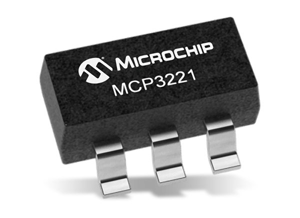

MCP3221 12-bit ADC
=========================

.. seo::
    :description: Instructions for setting up MCP3221 ADC with ESPHome
    :image: mcp3221.png
    :keywords: MCP3221

The ``mcp3221`` sensor platform allows you to use your MCP3221 ADC
(`datasheet <https://ww1.microchip.com/downloads/en/devicedoc/20001732e.pdf>`__, `Microchip`_, `Mouser`_) with ESPHome.

    Image by `Mouser`_

.. _Microchip: https://www.microchip.com/en-us/product/mcp3221
.. _Mouser: https://mouser.com/new/microchip/microchip-mcp3221-analog-digital-converters/

Connect power pins (``VCC``/``GND``, 2.7V to 5.5V) and I2C (``SDA``/``SCL``).

.. code-block:: yaml

    # Example configuration entry
    sensor:
      - platform: mcp3221
        name: "MCP3221 Value"
        #address: 0x48
        #reference_voltage: "3.3V"
        #update_interval: 60s

Configuration variables:
------------------------

- | **address** (*Optional*, int): Defaults to ``0x48``.
  | ``0b1001XXX`` - ``X``: See packaging for the last 3 bits,
  | Default: 000

- **reference_voltage** (*Optional*, float): Voltage used for reference, should be ``VCC``, range 2.7V to 5.5V

- **update_interval** (*Optional*, :ref:`config-time`): The interval to check the sensor. Defaults to ``60s``.
- All other options from :ref:`Sensor <config-sensor>`.

See Also
--------

- :doc:`adc`
- :ref:`i2c`
- :apiref:`mcp3221/mcp3221_sensor.h`
- :ghedit:`Edit`
